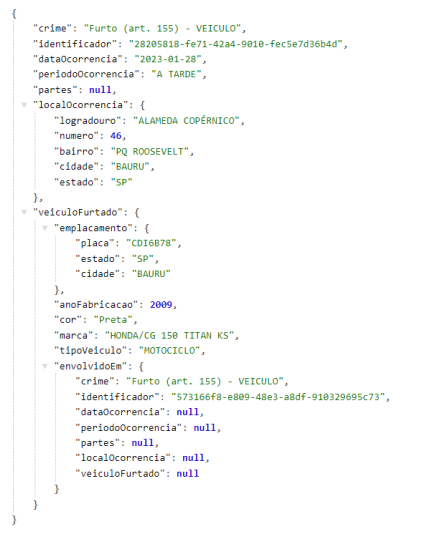

# WebService Boletins Furto Veiculos
Foi desenvolvida uma Web API REST para gerenciar o ciclo de vida de informações de boletins de ocorrência policial. O projeto foi implementado em Java com o uso do framework Spring Boot.

A Web API oferece as seguintes funcionalidades:
- Cadastro de boletim de ocorrência de furto de veículos.
- Exclusão de boletins previamente cadastrados.
- Alteração de boletins previamente cadastrados.
- Listagem de boletins previamente cadastrados com filtros por identificador do boletim de ocorrência, nome da cidade onde ocorreu o furto e período da ocorrência (manhã, tarde, noite, madrugada, etc.).
- Listagem de veículos furtados com filtros por placa, cor e tipo do veículo (carro, motocicleta, caminhão, etc.).

O sistema realiza validações das informações cadastrais, verificando se os dados informados pelo usuário são válidos para o cadastro de boletins de ocorrência. O conjunto de regras de validação foi elaborado pelo desenvolvedor do sistema e inclui exemplos como formato de e-mail, validade de datas e dados obrigatórios.

A persistência dos dados é realizada em memória principal, portanto não foi utilizado nenhum mecanismo de persistência de dados ou banco de dados.

Para garantir a conformidade com a Lei Geral de Proteção de Dados (LGPD), os dados das pessoas envolvidas, como vítimas, são devidamente omitidos.

A interface REST foi implementada utilizando JAX-RS e é executada no contexto de uma aplicação Spring Boot.

Abaixo está um exemplo da representação JSON de um boletim de ocorrência na API.

 

Uma das motivações para o desenvolvimento de Web APIs REST é a publicação de dados
para que outros sistemas possam utilizá-los. Sendo assim, foi implementado o
carregamento de dados disponibilizados pelo portal da transparência do governo de São
Paulo. A Secretaria de Segurança Pública (SSP) disponibiliza arquivos XLS (planilhas Excel)
sobre boletins de ocorrências policias.
